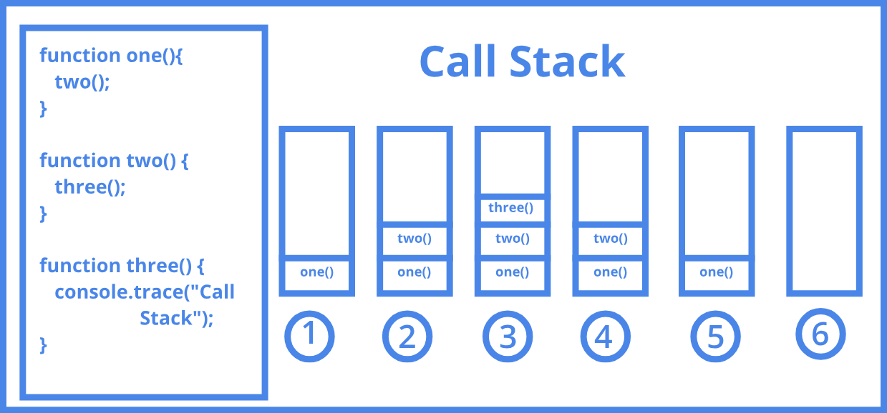

# An Introduction to Data Structures

## Introduction

As a self-taught web developer, I often find myself focusing on the immediate
demands of building applications and overlook the foundational concepts of data
structures and algorithms. However, as I dive deeper into the development of
applications, it has become increasingly clear to me that understanding data
structures is crucial for effective data management, user experience, and my own
understanding of the fundamental abstractions that lie just beneath the surface
of my applications. The understanding of basic data structures can help me
conceptualize data in a structured manner, enabling me to optimize access and
manipulation based on how the users interact with the data.

In essence, data structures provide a roadmap for organizing data efficiently,
guiding developers in making informed decisions about storage, retrieval, and
presentation. By mastering these tools, we can enhance both our coding skills
and the performance of our applications, ultimately leading to a more seamless
experience for our users. It is my hope that by introducing the basics of Data
Structures to you today that you might come away with a greater grasp on
Computer Science fundamentals, and how they play a pivotal role in the
development of software.

## Data And Data Structures

Many of us already know that Data is just information that has a recognizable
format conveying a single piece of or collection of values from which we can
derive meaning. Code, be it binary, hexadecimal, assembly language, or a
programming language, is just an expression of that data as well as an
established paradigm on how that data is processed and interpreted. In
programming languages, raw data is often conveyed within an abstract storage
location known as a <em>variable</em>.

Data Structures, as the name implies, is a form of data organization that aims
to structure that data for <em>efficient</em> access. By implementing Data
Structures, which can be thought of naively as an abstraction of data, a
computer programmer can easily read and write data with some end goal or purpose
such as statistical analysis, graphical processing, or simply more efficient
data retrieval. Indeed, Data Structures are the building blocks off of which
much of Computer Hardware, Software, and Firmware is based off of. The essential
data structures that every software developer should be intimately familiar with
are:

- Arrays
- Linked Lists
- Records (aka Tuples/Structs)
- Hash Tables(aka Hash Maps)
- Graphs
- Stacks
- Queues
- Trees

I will now do my best to give a brief, but succinct overview of each of these
data structures in turn with some small code examples in various programming
languages (mainly python) to demonstrate the essential uses of each:

### Arrays

Arrays are a data structure that nearly every beginner programmer quickly
becomes familiar with. After basic variable assignment and retrieval, and
perhaps conditional statements, beginner programmers learn about the data
structure that is the Array.

An Array, at it's core, is simply a collection of values. More specifically,
Arrays are a collection of values whose order is determined by their physical
placement in memory. This is something that many beginner software developers
miss if they have not worked in a lower level language, but the power of arrays
lies in the fact that their elements are ordered <em>by memory address</em>.
This allows for very quick accessing of the data in the array, as the CPU simply
has to read the <em>next memory address</em> in order to access the next element
of the array.

Depending on which programming language one learns, one will come to think of
Arrays slightly differently, as while they represent generally the same concept,
the implementation of Arrays in a language like C is significantly different
than languages like Java, C#, Python, or JavaScript. In C, for example, Arrays
must contain elements of the same memory size, must be of a fixed length, and
contain at least one <em>array index</em> or <em>key</em>. In JavaScript or
Python, Arrays/Lists are dynamic in size, can contain elements of different
memory sizes, and can contain no elements whatsoever.

Arrays are the most basic data structure, and are utilized to build out more
complex data structures such as vectors(tuples), matrices(multi-dimensional
arrays, i.e. arrays of arrays), lists, queues, hash tables, stacks, strings,
etc. The following are some basic examples of arrays in different programming
languages and some essential uses of them:

```c
// Basic Array usage in C
#include <stdio.h>

int main() {
    int array[5] = {1, 2, 3, 4, 5};

    int first_element = array[0];  // 1
    int last_element = array[4];   // 5

    array[2] = 10;  // array becomes {1, 2, 10, 4, 5}

    // Assigning the first element of the array to a variable
    int first_element = array[0];  // 1
    for(int i = 0; i < 5; i++) {
        printf("%d ", array[i]);
    }
    printf("\n");

    return 0;
}
```

```js
// Basic Array usage in JavaScript
let array = [1, 2, 3, 4, 5];

let firstElement = array[0]; // 1
let lastElement = array[array.length - 1]; // 5

array[2] = 10; // array becomes [1, 2, 10, 4, 5]

array.push(6); // array becomes [1, 2, 10, 4, 5, 6]

array.splice(3, 1); // array becomes [1, 2, 10, 5, 6]
```

```py
# Basic Array usage in Python
array = [1, 2, 3, 4, 5]

first_element = array[0]  # 1
last_element = array[-1]  # 5

array[2] = 10  # array becomes [1, 2, 10, 4, 5]

array.append(6)  # array becomes [1, 2, 10, 4, 5, 6]

array.pop(3)  # array becomes [1, 2, 10, 5, 6]
```

### Linked Lists

Unlike Arrays, Linked Lists are a linear collection of data whose order is not
given by their physical placement in memory (i.e. there is no index to reference
the elements). Instead, Linked Lists are defined as being a collection of
<em>nodes</em> which together represent a <em>sequence</em>.

Put simply, each Node of a Linked List contains some form of data, as well as a
key called a "pointer", usually termed "next", which "points" to the next Node
in the Linked List. This goes on and on until the "next" pointer "points" to
`null` (i.e. there is no other node to traverse to).

Linked Lists are instantiated with a single empty node called the "head", which
initially points to `null`. As new nodes are inserted to the beginning of the
Linked List, the head is assigned some data and a "next" pointer. The following
python code demonstrates what is known as a "Singly Linked List", defined by the
fact that it can only be traversed in one direction (unlike "Doubly Linked List"
which has Nodes that also have a "previous" pointer).

```py
# Original Linked List:
class Node:
    def __init__(self, data):
        self.data = data
        self.next = None

class LinkedList:
    def __init__(self):
        self.head = None


    def insertAtBegin(self, data):
        new_node = Node(data)
        if self.head is None:
            self.head = new_node
            return
        else:
            new_node.next = self.head
            self.head = new_node

# If we instantiate a list like so:
llist = LinkedList()
# Our linked list looks like this:
# List looks something like this:
# {head: null}

# And then insertAtBegin:
llist.insertAtBegin('c')
# Our linked list looks like this:
# {head: {data: 'c', next: null}}

# If we insertAtBegin again:
llist.insertAtBegin('b')
# Our linked list looks like this:
# {head: {data: 'c', next: {data: 'b', next: null}}}

# And we insertAtBegin again:
llist.insertAtBegin('a')
# Our linked list looks like this:
# {head: {data: 'c', next: {data: 'b', next: {data: 'a', next: null}}}}

# And so on...
```

This example was taken in part from
[This Geeks For Geeks Article](https://www.geeksforgeeks.org/python-linked-list/),
where you can find more common methods utilized with a Singly Linked Lists. It
is important to note that this is just one form of Linked Lists, as there are
others such as Doubly Linked Lists and Circular Linked Lists.

The principal benefit of using a Linked List over an Array is that the list
elements can be easily inserted or removed without reallocation or
reorganization of the entire structure because the data items do not need to be
stored in contiguous memory or on disk. It's strength is also it's weakness,
however, as the lack of utilizing memory contiguously means that you lose random
access to the data by index. This becomes important to consider depending on how
you will choose to apply these data structures.

### Records (aka Tuples/Structs)

A record (also known as a Structure/Struct) is a composite data structure,
meaning that it is a collection of fields (possibly of different data types),
typically fixed in number and sequence. Here is an example of a tuple in Python,
followed by an example in JavaScript, and then also in C:

```py
person = ("John", 30, "Engineer")

name = person[0]    # "John"
age = person[1]     # 30
occupation = person[2]  # "Engineer"

# Tuples are immutable, so we cannot modify the elements
# However, we can access and use the values as needed
print(f"Name: {name}, Age: {age}, Occupation: {occupation}")
```

```js
const person = {
  name: "John",
  age: 30,
  occupation: "Engineer",
};

const name = person.name; // "John"
const age = person.age; // 30
const occupation = person.occupation; // "Engineer"

console.log(`Name: ${name}, Age: ${age}, Occupation: ${occupation}`);
```

```c
#include <stdio.h>

struct Person {
    char name[50];
    int age;
    char occupation[50];
};

int main() {
    struct Person person = {"John", 30, "Engineer"};

    printf("Name: %s, Age: %d, Occupation: %s\n", person.name, person.age, person.occupation);

    return 0;
}
```

Note that the Tuple Data Type in Python takes a slightly different approach, and
has another Data Type called the Dictionary, which looks and behaves very
similarly to the way Objects do in JavaScript. Indeed, the tuple, dictionary,
struct, and object all are instances of records, albeit with their own
differences in how they behave.

Note that in truth, the Python Tuple follows the conventions defined for the
Record Data Type in that it's fields are <em>immutable</em>, and enforce type
safety after instantiation, whereas Dictionaries in Python, Objects in
JavaScript, and Structs in C do not follow these conventions, and thusly are
more akin to another data structure called an Associative Array.

Records are utilized heavily in Database Tables, SpreadSheets, and Comma
Separated Values(CSV files.) In Databases and Spreadsheets, a record is known as
a <em>row</em> and its field is called a <em>column</em>. Here is an example of
a simple SQL table using the same data as the previous examples:

|        | name   | age | occupation |
| ------ | ------ | --- | ---------- |
| person | "John" | 30  | "Engineer" |

Like arrays, the fields within records are stored in consecutive memory
locations, and thusly take advantage of very fast look-up/access times.

### Hash Tables(aka Hash Maps)

A Hash Table is a data structure that implements an Associative Array, often in
conjunction with utilizing a hash function to compute an index. This index often
then points to an array or a linked list of data known as <em>buckets</em> or
<em>slots</em>, from which a desired value can be found. The following is an
example of using python's native `hash` method to create a very basic Hash
Table:

```py
hash_table = {}

def insert(key, value):
    hashed_key = hash(key)
    hash_table[hashed_key] = value

def get(key):
    hashed_key = hash(key)
    return hash_table.get(hashed_key, "Key not found")

def delete(key):
    hashed_key = hash(key)
    if hashed_key in hash_table:
        del hash_table[hashed_key]
    else:
        print("Key not found")

insert("name", "John")
insert("age", 30)
insert("occupation", "Engineer")

print(get("name"))        # "John"
print(get("age"))         # 30
print(get("occupation"))  # "Engineer"

print(get("address"))     # "Key not found"

delete("age")

print(get("age"))         # "Key not found"

# Print the entire hash table to show the hashed keys and their values
print("\nHash Table Contents:")
for hashed_key, value in hash_table.items():
    print(f"Hashed Key: {hashed_key} -> Value: {value}")
```

And some example output (note that the hash function utilized on your machine
might give different output of the actual hashes):

```
John
30
Engineer
Key not found
Key not found

Hash Table Contents:
Hashed Key: -6504617670517689132 -> Value: John
Hashed Key: -3610802714639523146 -> Value: Engineer
```

Hash Tables are utilized very often for lookup tables that leverage the
strengths of hashing algorithms to speed up lookup times. A very naive
explanation of this is that the length and uniqueness of the hash string
determines how quickly the value can be accessed by the hash key. This also
requires a more in depth understanding of search algorithms in order to choose
the method most effective for accessing the data at the hash key.

In essence, however, one should simply know that hash tables are generally
considered more efficient than other data structures for accessing data, and are
utilized under the hood in many programming languages for implementing
Associative Arrays, Database Indexing, Caching, Sets, and Maps.

### Graphs

The Graph Data Structure is an abstract data type that consists of a finite, and
possibly mutable, set of vertices (also known as <em>nodes</em> or
<em>points</em>). Each pair of vertices are linked together by an abstract
structure known as an <em>edge</em>. Here is a simple Graph data structure
exemplified in python:

```py
class Graph:
    def __init__(self):
        # Use a dictionary to store the graph
        # Each key is a node, and the value is a list of adjacent nodes
        self.graph = {}

    def add_edge(self, node, neighbor):
        # If the node is not in the graph, add it with an empty list
        if node not in self.graph:
            self.graph[node] = []
        # Add the neighbor to the node's adjacency list
        self.graph[node].append(neighbor)

    def print_graph(self):
        for node, neighbors in self.graph.items():
            print(f"{node} -> {', '.join(map(str, neighbors))}")

g = Graph()

g.add_edge("A", "B")
g.add_edge("A", "C")
g.add_edge("A", "D")
g.add_edge("B", "C")
g.add_edge("B", "E")
g.add_edge("D", "E")
g.add_edge("D", "F")

g.print_graph()
```

And the output of the `print_graph()` function:

```
A -> B, C, D
B -> C, E
D -> E, F
```

Here is a visual representation of the example graph just implemented:


Graphs are commonly used in areas such as machine learning, social network
analysis, and other areas.

### Stacks

A Stack is a Data Structure that serves as a collection of elements with two
main operations: <em>Push</em> and <em>Pop</em>, with an optional third
operation called <em>Peek</em>.

The Stack is often demonstrated using the analogy of a stack of plates, in which
when one "pushes" onto the stack, the latest plate is put on the "end" of the
stack, i.e. the top of the stack of plates. Should one then wish to do the
dishes and wash the stack of plates, the easiest way would be to "Pop" the last
plate off the top of the stack and clean it first, continually "Popping" the top
plate off the stack until there are no more plates left to clean.

A simple principle associated with the stack is the "Last In, First Out"
principle, referred to by the acronym, <b>LIFO</b>. Arrays are often confused
with stacks, but in actuality, stacks are a distinctly different data structure,
as by definition one can only access a stack's data by popping or peeking the
last data element on the stack (referred to as the "top"). That said, stacks are
often implemented in programming languages using arrays, and less often using
linked lists.

The following is an example of a basic stack in python:

```py
class Stack:
    def __init__(self):
        self.stack = []

    def push(self, element):
        self.stack.append(element)

    def pop(self):
        if not self.is_empty():
            return self.stack.pop()
        else:
            return "Stack is empty"

    def peek(self):
        if not self.is_empty():
            return self.stack[-1]
        else:
            return "Stack is empty"

    def is_empty(self):
        return len(self.stack) == 0

    def display(self):
        print("Stack:", self.stack)

s = Stack()

s.push(1)
s.push(2)
s.push(3)

s.display()  # Stack: [1, 2, 3]

print("Peek:", s.peek())  # Peek: 3

print("Pop:", s.pop())  # Pop: 3

s.display()  # Stack: [1, 2]

print("Pop:", s.pop())  # Pop: 2
print("Pop:", s.pop())  # Pop: 1
print("Pop:", s.pop())  # Pop: Stack is empty

s.display()  # Stack: []
```

And the output of the above example:

```
Stack: [1, 2, 3]
Peek: 3
Pop: 3
Stack: [1, 2]
Pop: 2
Pop: 1
Pop: Stack is empty
Stack: []
```

For clarity, here is an example of a stack implemented using a Linked List:

```py
class Node:
    def __init__(self, data):
        self.data = data
        self.next = None

class Stack:
    def __init__(self):
        self.top = None

    def push(self, element):
        new_node = Node(element)
        new_node.next = self.top
        self.top = new_node

    def pop(self):
        if not self.is_empty():
            popped_data = self.top.data
            self.top = self.top.next
            return popped_data
        else:
            return "Stack is empty"

    def peek(self):
        if not self.is_empty():
            return self.top.data
        else:
            return "Stack is empty"

    def is_empty(self):
        return self.top is None

    def display(self):
        current = self.top
        stack_representation = []
        while current:
            stack_representation.append(current.data)
            current = current.next
        print("Stack:", stack_representation)

s = Stack()

s.push(1)
s.push(2)
s.push(3)

s.display()  # Stack: [3, 2, 1]

print("Peek:", s.peek())  # Peek: 3

print("Pop:", s.pop())  # Pop: 3

s.display()  # Stack: [2, 1]

print("Pop:", s.pop())  # Pop: 2
print("Pop:", s.pop())  # Pop: 1
print("Pop:", s.pop())  # Pop: Stack is empty

s.display()  # Stack: []
```

And the output of this example:

```
Stack: [3, 2, 1]
Peek: 3
Pop: 3
Stack: [2, 1]
Pop: 2
Pop: 1
Pop: Stack is empty
Stack: []
```

The stack is a very essential data structure to how programs work. The
implementation of procedural calls (aka Functions) relies in many programming
languages on a paradigm known as the "Call Stack", in which methods are "Pushed"
onto the Call Stack as they are instantiated and called. After the procedural
call returns or terminates, the memory allocated to the procedural call is freed
(either manually or through garbage collection) and is "Popped" off the Call
Stack. Here is a simple diagram demonstrating the concept:



In the above diagram, if we follow this program by calling function `one()`:

```js
function one() {
  two();
}

function two() {
  three();
}

function three() {
  console.trace("Call Stack");
}

one();
```

If we put this function into a file called `example.js` and then call this
program using node we will get the following output:

```
Trace: Call Stack
    at three (example.js:10:11)
    at two (example.js:6:3)
    at one (example.js:2:3)
    at Object.<anonymous> (example.js:13:1)
    at Module._compile (node:internal/modules/cjs/loader:1546:14)
    at Module._extensions..js (node:internal/modules/cjs/loader:1691:10)
    at Module.load (node:internal/modules/cjs/loader:1317:32)
    at Module._load (node:internal/modules/cjs/loader:1127:12)
    at TracingChannel.traceSync (node:diagnostics_channel:315:14)
    at wrapModuleLoad (node:internal/modules/cjs/loader:217:24)
```

The Call Stack is a fundamental paradigm in understanding how programs utilize
the basic data structure of The Stack to execute programs.

### Queues

A Queue is a collection of data entities that are maintained in a sequence and
can be modified by the addition of entities at one end of the sequence and the
removal of entities at the other end. A commonly used analogy is a Person
Waiting in Line.

When a person walks up to a park attraction or a concert event they wish to
attend, and need to purchase a ticket, and if there are other people waiting to
get a ticket ahead of them, then they joined a Queue. Specifically they have
engaged in a process called an "Enqueue", in which they are the last person in
the line, known as the "Back". As the person makes their way through the line,
others line up behind them, and others ahead of the person receive their ticket
and continue on to the event.

When our person arrives at the ticket booth, they have arrived at the "Front" of
the Queue. They purchase their ticket and go to the event, leaving the line. The
process of leaving the line is known as engaging in a "Dequeue".

Queues generally follow what is known as the "First In, First Out" principle,
known more commonly by the acronym, <b>FIFO</b>.

Queues are used to abstract data that "streams" from one service to the next,
and is often used to create a "buffer". Queues are also used for message queues
(often utilized in the Pub/Sub model of software architecture). Arrays and
Linked Lists can be utilized to implement a Queue. Here is an example in
javascript using arrays:

```js
class Queue {
  constructor() {
    this.items = [];
  }

  enqueue(item) {
    this.items.push(item);
  }

  dequeue() {
    if (!this.isEmpty()) {
      return this.items.shift(); // Removes the first item from the array
    } else {
      return "Queue is empty";
    }
  }

  peek() {
    if (!this.isEmpty()) {
      return this.items[0]; // Returns the first item in the array
    } else {
      return "Queue is empty";
    }
  }

  isEmpty() {
    return this.items.length === 0;
  }

  display() {
    console.log("Queue:", this.items);
  }
}

const q = new Queue();

q.enqueue(1);
q.enqueue(2);
q.enqueue(3);

q.display(); // Queue: [1, 2, 3]

console.log("Peek:", q.peek()); // Peek: 1

console.log("Dequeue:", q.dequeue()); // Dequeue: 1

q.display(); // Queue: [2, 3]

console.log("Dequeue:", q.dequeue()); // Dequeue: 2
console.log("Dequeue:", q.dequeue()); // Dequeue: 3
console.log("Dequeue:", q.dequeue()); // Dequeue: Queue is empty

q.display(); // Queue: []
```

And the output of the above example:

```
Queue: [1, 2, 3]
Peek: 1
Dequeue: 1
Queue: [2, 3]
Dequeue: 2
Dequeue: 3
Dequeue: Queue is empty
Queue: []
```

Note that like Stacks, Queues can often be confused with Arrays, but they are a
fundamentally more limited Data Structure. Queues can only ever "Push" (enqueue
a piece of data onto the end of the queue) or "Shift" (dequeue a piece of data
off of the beginning of the queue).

### Trees

A tree is a widely used Data Structure that represents a hierarchical tree
structure with a set of connected nodes. Each node in the tree can be connected
to many children (depending on the type of tree), but must be connected to
exactly one parent (differentiating Trees from Graphs). The original node that
has no parent of it's own sits at the "top" of the tree, and is known as the
"root" node. Here is an example of a tree implemented in python:

```py
class Node:
    def __init__(self, value):
        self.value = value
        self.children = []

    def add_child(self, child_node):
        self.children.append(child_node)

    def __repr__(self, level=0):
        ret = " " * (level * 4) + repr(self.value) + "\n"
        for child in self.children:
            ret += child.__repr__(level + 1)
        return ret

class Tree:
    def __init__(self, root_value):
        self.root = Node(root_value)

    def add(self, value, parent_value):
        parent_node = self.find(self.root, parent_value)
        if parent_node:
            parent_node.add_child(Node(value))
        else:
            print(f"Parent node {parent_value} not found!")

    def find(self, node, value):
        if node.value == value:
            return node
        for child in node.children:
            result = self.find(child, value)
            if result:
                return result
        return None

    def __repr__(self):
        return repr(self.root)

tree = Tree("A") # Root Node
tree.add("B", "A") # Child of A, is B
tree.add("C", "A") # Child of A, is C
tree.add("D", "B") # Child of B, is D
tree.add("E", "B") # Child of B, is E
tree.add("F", "C") # Child of C, is F
tree.add("G", "C") # Child of C, is G

print(tree)
```

And here is the output of the above example:

```
'A'
    'B'
        'D'
        'E'
    'C'
        'F'
        'G'
```

And here is a graphic representation of this tree data structure:


Trees have a multitude of applications including in File Systems, specifically
for organizing of files into a Directory Structure. In fact on most Unix like
Operating Systems like MacOS and Linux, you can invoke a command line utility
called `tree` to visually see the output of your directory structure. Here is
the output of the directory structure of this repository using the
`tree command`:

```sh
tree
```

Outputs:

```
.
├── assets
│   ├── call_stack.png
│   ├── graph_data_structure.jpg
│   ├── the_dom.jpg
│   └── tree_data_structure.png
├── docs
│   └── data_structures.md
├── LICENSE
└── Session.vim

3 directories, 7 files
```

Web Developers interact and have a concept of Trees through the paradigm of the
"Document Object Model", more commonly known as the DOM, which organizes into a
hierarchical structure a series of HTML elements:


Even JSON an YAML documents can be thought of as trees, but are typically
represented by nested lists and dictionaries.

And this is just scratching the surface of the various applications of the Tree
Data Structure.

### Conclusion

We've now covered the very basics of the essential data structures common to
many paradigms within the realm of Computer Science and Software Development.
Hopefully, I've exemplified how fundamental concepts like arrays, linked lists,
records, hash tables, graphs, stacks, and queues form the backbone of effective
data management and algorithm design.

Before we close, consider this: How would the efficiency of your applications
change if you could choose the most appropriate data structure for every problem
you encounter? Reflecting on this can help underline the importance of mastering
these basics.

Understanding Data Structures is an essential component of Software Architecture
and Design, but without Algorithms, we are limited in what our software can do.
In the next installment of this short series, we'll dive deeper into how to
leverage these data structures utilizing beginner-friendly algorithms. We'll
explore practical examples and problem-solving techniques to bring these
concepts to life and further enhance your programming skills.
